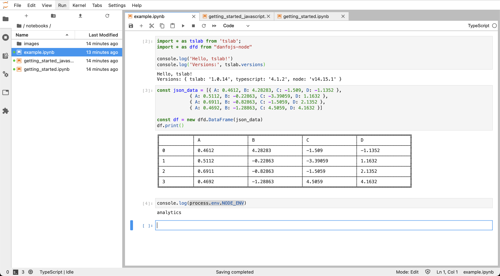

# tslab-extended

Jupyter NoteBook + Node.js + TypeScrit. Based on [tslab](https://github.com/yunabe/tslab), but with batteries.

# Install

1. Fork repo
1. `git clone {your-fork}.git`
1. `cd {your-repo-folder}`
1. Add your envs to `.env`
1. Add libraries to package.json
1. `docker-compose up -d`
1. Find link in docker logs

# Useful links

https://github.com/yunabe/tslab-examples
